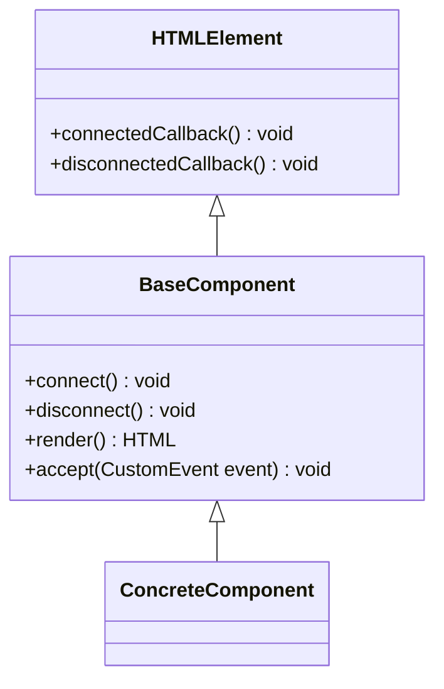

# Web Components

This document describes some design decisions made implementing _native web-components_ using vanilla _JavaScript_.

## Base Component

The base component provides common functionality to all implementing child components. It _slightly_ modifies the usual
interface for web component in order to extend specific lifecycle callbacks with common logic.



A custom web component &hellip;

* &hellip; _must_ override the `render()` method returning an HTML template string (otherwise, the component will render
  to `<span></span>`)
* &hellip; _must_ override the `accept(CustomEvent)` method if it wants to listen to application events.
* &hellip; _may_ override methods `connect()` and `disconnect()`.

### Lifecycle Handling

The standard lifecycle methods are mapped in order to be able to _add_ behaviour to a web component. The standard
methods are implemented in the _base_ class and _delegate_ its calls to the _mapped_ methods provided by the extending
class.

| Standard Method          | Mapped Method  |
| ---                      | ---            |
| `connectedCallback()`    | `connect()`    |
| `disconnectedCallback()` | `disconnect()` |

### Application Event Handling

A child component may define a _list_ of event types
(cf. [`EventType.js`](../src/main/resources/static/js/events/EventType.js)) it is interested in. The base component registers
event listeners for all given types:

```javascript
export class Child extends BaseComponent {
  constructor() {
    super(['EventType', 'OtherEventType']);
    // Rebind parent accept method:
    this.accept = this.accept.bind(this);
  }

  handleEventType(applicationEvent) {
    // handle it...
  }

  handleOtherEventType(applicationEvent) {
    // handle it...
  }

  /**
   * @param {CustomEvent} event The Event to handle.
   */
  accept(event) {
    if (event.type === 'EventType') {
      this.handleEventType(event.detail);
    } else if (event.type === 'OtherEventType') {
      this.handleOtherEventType(event.detail);
    } else {
      // console.warn() or throw error...or ignore because this should not happen.
    }
  }
}
```

